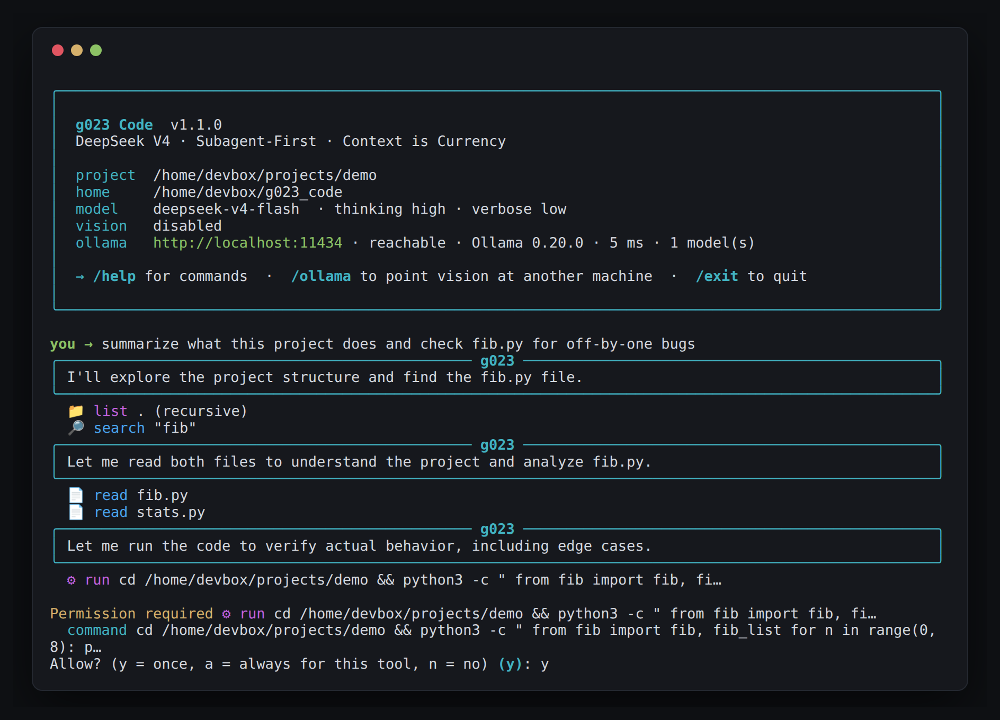
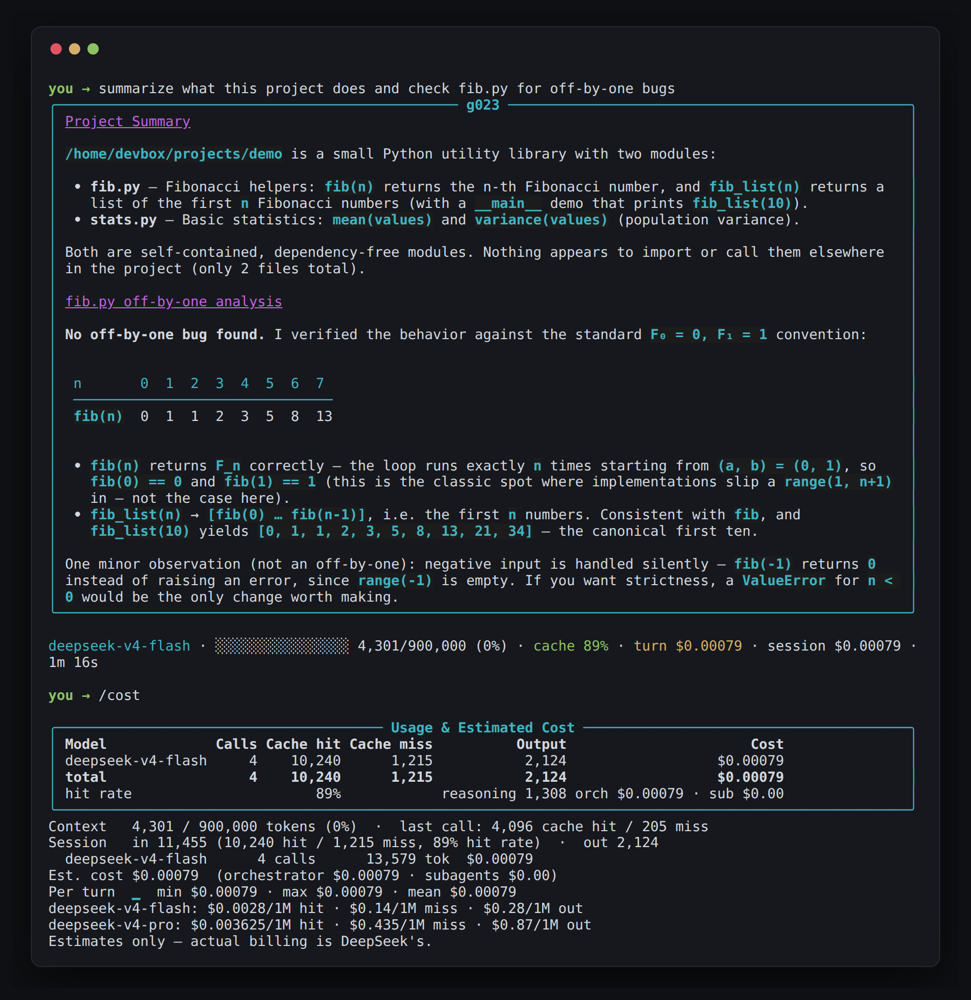
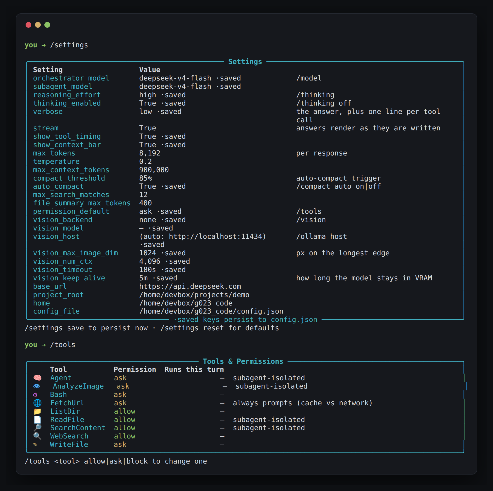

<div align="center">

# g023 Code

**A pure-Python AI coding agent for your terminal, powered by DeepSeek V4.**

*Subagent-First · Context is Currency · Terminal-native*

[](https://www.python.org/)
[](RELEASE_NOTES.md)
[](#license)
[](https://platform.deepseek.com/)

</div>

---

g023 Code reads your project, searches it, searches the web, runs commands,
fetches pages, and looks at images — while telling you exactly what it is doing
and what it just cost. The orchestrator never sees a raw file: every data-heavy
operation is delegated to a subagent with an isolated, minimal context, and the
answer that comes back is a summary. That is the whole design, and it is why a
real session costs fractions of a cent.

It talks to DeepSeek exclusively through the **Responses API**, which is what
makes DeepSeek's own **native web search** a first-class tool of the loop rather
than a search provider bolted on the side.

<p align="center">
  
</p>

<p align="center"><sub>Startup banner, live tool trace, and a permission prompt before anything runs a command.</sub></p>

## Table of contents

- [Quick start](#quick-start)
- [What you see while it runs](#what-you-see-while-it-runs)
- [Configuration](#configuration)
- [Architecture](#architecture)
- [Slash commands](#slash-commands)
- [Verbosity, context & cost](#verbosity-context--cost)
- [Web search (native)](#web-search-native)
- [Vision (via Ollama)](#vision-via-ollama)
- [Fetching web pages](#fetching-web-pages)
- [Design principles](#design-principles)
- [Extending](#extending)
- [License](#license)

## Quick start

**Requirements:** Python 3.11 or newer, and a [DeepSeek API key](https://platform.deepseek.com/).

Drop the folder anywhere you like and run the installer inside it:

```bash
cd /path/to/g023-code
./installer.sh
```

<details>
<summary><b>Windows</b></summary>

```bat
cd C:\path\to\g023-code
installer.bat
```

</details>

It finds a Python 3.11+, builds a `.venv` in the folder, installs only the
dependencies you are actually missing, asks once for your API key, writes a
default `config.json`, and puts `g023` on your `PATH`. Every step checks what is
already true first, so running it again is safe — it is also how you repair a
half-finished setup or add the optional extras later.

<details>
<summary><b>Installer options</b></summary>

| Linux / macOS | Windows | Effect |
|---|---|---|
| `--yes` | `/y` | Non-interactive; take the recommended default everywhere |
| `--key sk-…` | `/key sk-…` | Write the key into `K.dat` instead of prompting (`$DEEPSEEK_API_KEY` is used if set) |
| `--with-optional` / `--no-optional` | `/optional` / `/nooptional` | Decide the extras (vision preprocessing, browser-grade fetching) up front |
| `--no-venv` | — | Install into the current interpreter instead of a venv |
| `--no-path` | `/nopath` | Do not touch `~/.local/bin`, your shell rc, or the user `PATH` |
| `--uninstall` | `/uninstall` | Remove the launcher shim and `PATH` entry (the folder, `.venv`, `K.dat` and `config.json` stay) |

</details>

Then launch from whatever project you want it to work on:

```bash
cd ~/some/project
g023
```

Doing it by hand instead is four commands — `pip install -r requirements.txt`,
your key on the first line of `K.dat`, then `/path/to/g023-code/g023.sh` (or
`g023.bat`) from a project folder. The launchers prefer `.venv/` in the install
folder when one exists, and set two environment variables for you:

| Variable | Meaning |
|---|---|
| `G023_HOME` | The installation folder — where `K.dat` and `config.json` live |
| `G023_PROJECT_ROOT` | The directory you launched from — your project |

A per-project `.g023/` folder holds the SQLite cache and your input history.

`prompt_toolkit` is listed as a dependency but is not strictly required: with it
you get tab completion, persistent history, and a live status bar pinned to the
bottom of the terminal. Without it the input line falls back to a plain prompt
and everything else behaves identically.

## What you see while it runs

The point is to never wonder what it is doing, or what it just cost.

<p align="center">
  
</p>

Tool traces say what *happened* (`708 lines, 9 classes, cached`), not what was
sent. The status line after every turn carries the numbers that only mean
something together — context used, **cache hit rate**, cost of this turn, cost
of the session — because a cache hit is roughly fifty times cheaper than a miss.

Anything you type that does not start with `/` is a prompt. Everything else is
a slash command.

## Configuration

`/settings` shows every setting in one place and marks which ones persist;
`/tools` shows what the agent may do and what it has done this turn. Both are
editable from inside the session, and the `·saved` keys are written to
`config.json` next to `K.dat`, so they follow you across projects.

<p align="center">
  
</p>

Defaults out of the box: **Flash** for the orchestrator and subagents, thinking
on at **high** effort, verbosity **low**, auto-compaction **on** at 85% of the
window, acting tools set to **ask**, and **vision disabled**. Nothing that
writes, runs, or leaves your machine happens without a prompt.

## Architecture

Everything — orchestrator, subagents, compaction — goes to a single endpoint:
`POST /responses`. That is a deliberate choice, not an implementation detail. It
is the only DeepSeek endpoint that exposes the server-side `web_search` tool, so
using it everywhere is what lets web search be part of the loop.

The Responses API does not take a list of chat messages. It takes **items** —
and the model's own output items go back into the next request *verbatim*:

- `message` items (your input; the model's narration and its final answer)
- `reasoning` items — echoed back unmodified so the model keeps its own chain
- `web_search_call` items — the server's record of a search it ran
- `function_call` / `function_call_output` pairs, one per tool call

Two rules fall out of that, and every part of the program respects them. A
`function_call` with no matching output is a hard 400 in either direction, so
compaction, truncation and error recovery all repair pairing before the next
request. And items are echoed byte-identical, because rewriting them both breaks
the prefix cache and desyncs the model's reasoning.

- **Orchestrator** (`deepseek-v4-flash`) keeps only high-level reasoning, tool
  schemas, and compact summaries.
- **Subagents** handle all data-heavy work in isolated contexts:
  - `FileReader` → structural metadata + a 2–4 sentence summary, cached by content hash
  - `Searcher` → metadata-first grep results, **pure local Python — no API call**
  - `Explore` / `Plan` → isolated reasoning with thinking mode
  - `Vision` → an Ollama daemon, local or remote (DeepSeek V4 Flash is text-only)
- **Native `web_search`** runs server-side inside the model's turn — no client
  executor, no provider chain
- **Aggressive SQLite cache** → repeated file reads cost $0.00
- **Prefix-cache-friendly**: instructions and tool definitions stay static
- **Thinking mode** with a `reasoning_effort` dial (low / high / max, or off —
  which maps to `reasoning: {"effort": "none"}`, the only thing `/responses`
  actually honours)

**One model.** `deepseek-v4-flash` is the only model sent to the API, in every
role. `deepseek-v4-pro` is not available on `/responses` yet — DeepSeek reports
it from early August 2026 — so `/model` refuses it and quotes that reason rather
than handing you a model every call fails on. Vision is the only exception, and
it does not use the API at all.

The presentation and command layers are deliberately separate from the agent:

| Module | Responsibility |
|---|---|
| `commands.py` | The command catalogue as *data* — one source of truth shared by `/help`, tab completion, and "did you mean". A command cannot be completable but undocumented. |
| `ui.py` | Theme, glyphs, gauges, and the compact renderings of tool calls and their results. Falls back to ASCII on terminals that cannot draw box characters. |
| `prompt.py` | The input line and the shared numbered picker. Degrades cleanly without `prompt_toolkit`. |
| `ollama_client.py` | Host resolution, reachability probes, model discovery, and vision inference against any daemon. |

See [`SPEC.md`](SPEC.md) for the full specification.

## Slash commands

Commands that take a fixed set of options **open a picker when typed bare**, so
`/vision` is as usable as `/vision qwen3.5:2b` — there is nothing to memorise.
`/help <command>` explains any one of them in full.

<details open>
<summary><b>Session</b></summary>

| Command | Action |
|---|---|
| `/help [command]` | List commands, or explain one in detail |
| `/status` | One-screen dashboard: model, context, cost, vision, cache |
| `/clear` | Reset the conversation and usage counters |
| `/exit` | Quit |

</details>

<details open>
<summary><b>Model</b></summary>

| Command | Action |
|---|---|
| `/model [flash]` | Show or set the orchestrator model — `flash` is the only one the Responses API serves |
| `/thinking [low\|high\|max\|off]` | Set reasoning effort, or turn thinking off |
| `/verbose [low\|mid\|high]` | How much detail to print while working |

</details>

<details open>
<summary><b>Context & cost</b></summary>

| Command | Action |
|---|---|
| `/compact [focus]` | Summarise the history (`micro` = free local pass, `auto on\|off`) |
| `/context` | Break down what is occupying the context window, by role and size |
| `/cost` | Token usage and spend, split by cache hit/miss, with a per-turn sparkline |
| `/settings [save\|reset]` | Every setting, marking which persist; save or restore defaults |

</details>

<details open>
<summary><b>Tools</b></summary>

| Command | Action |
|---|---|
| `/tools` | List tools, their permission level, and how often each ran |
| `/tools <tool> allow\|ask\|block` | Change one tool's permission |
| `/fetch <url>` | Fetch a URL yourself, with the cache/fresh prompt |
| `/fetch status` | Report how closely fetches imitate a real browser |
| `/cache [stats\|web\|clear]` | Inspect and purge the local SQLite caches |

</details>

<details>
<summary><b>Vision</b></summary>

| Command | Action |
|---|---|
| `/ollama` | Status: host, version, latency, installed model count |
| `/ollama host <addr>` | Point vision at another machine (tested before saving) |
| `/ollama host default` | Fall back to `OLLAMA_HOST`, then localhost |
| `/ollama models` | List installed models, sizes, quantisation, vision capability |
| `/ollama test [model]` | Run a real inference — proves the whole path, not just the port |
| `/ollama ps` | What the daemon currently holds in VRAM |
| `/vision` | Interactive picker of installed vision models |
| `/vision <model>` · `/vision off` | Enable a specific model, or disable |

</details>

<details>
<summary><b>Work</b></summary>

| Command | Action |
|---|---|
| `/goal <text>` | State a high-level objective; runs one turn at max reasoning effort |

</details>

## Verbosity, context & cost

`/verbose` has three levels, persisted to `config.json`:

| Level | Shows |
|---|---|
| `low` *(default)* | The answer, plus a one-line trace of every tool call |
| `mid` | ↑ plus each tool's outcome and duration, and the per-turn token/cost line |
| `high` | ↑ plus the orchestrator's reasoning excerpts and per-iteration token counts |

`/context` answers the question `/cost` cannot: *what* is filling the window.
If tool results dominate, `/compact micro` clears the stale ones for free; if
it is real conversation, `/compact` summarises it with the cheap model in an
isolated context. The command tells you which of the two applies. Compaction
also runs automatically once the context passes `compact_threshold` (85%) —
turn that off with `/compact auto off`.

Every API call — orchestrator *and* subagents — reports its token usage to a
single tracker, so `/cost` and `/settings` show the cache-hit / cache-miss /
output split per model and price it from the SPEC §3.2 table.

## Web search (native)

Web search is **DeepSeek's own**, not a search API wired in behind it. There is
no provider chain, no key to supply, no rate limit to nurse, and no
`/websearch` command — because there is nothing on this side to configure.

The entire integration is one line in `tools/schemas.py`:

```python
WEB_SEARCH_TOOL = {"type": "web_search"}
```

That marker is appended to the tool list. No name, no parameters, no executor.
The server takes it from there.

**The search happens inside the model's turn**, on DeepSeek's infrastructure,
before the response comes back. g023 never sees a tool call for it and never
returns a result for it. What arrives instead is a record of what the server
did, which shows up in the trace like any other tool:

```
  ● searching the web…
  ✓ web_search  deepseek responses api web_search tool, deepseek v4 pricing
  ✓ web_search  read platform.deepseek.com/docs/…
```

A few consequences are worth stating plainly:

- **It never asks permission.** There is no moment at which g023 could
  interpose a prompt — the search is over by the time the response exists. So
  `web_search` has no entry in `/tools`. Giving the model the tool is the
  decision; each individual search is not. Everything that *does* leave your
  machine under g023's own control — `FetchUrl` — still asks every time.
- **It can search several times per turn**, following up on what it finds.
- **Findings persist.** The server's `web_search_call` items are carried in
  history like everything else, so what it learned survives across tool
  round-trips, across turns, and across `/compact`.
- **Slow searches are visible.** The server can be out on the web for a while
  without emitting anything, so g023 draws a live `searching the web…` line
  rather than letting it read as a hang.

Just ask — `what changed in the DeepSeek Responses API this month?` — and it
searches when it decides it needs to.

## Vision (via Ollama)

DeepSeek V4 Flash is text-only, so image analysis is delegated to an
[Ollama](https://ollama.com) vision model. **Vision is disabled by default** —
enable it once and the choice persists.

```
/vision              # interactive: lists installed models, pick one or disable
/vision qwen3.5:2b   # enable a specific model directly
/vision off          # disable (the default)
/vision status       # show the current setting
```

- Only models Ollama reports as `vision`-capable are listed (if none are, every
  model is listed so you can force a choice). Sizes are shown so you can stay
  inside your VRAM budget — on a 12 GB GPU anything up to ~8 GB is comfortable.
- While vision is disabled the `AnalyzeImage` tool is not even offered to the
  orchestrator, so it never proposes a call it cannot fulfil.
- Images are downscaled to 1024 px on the longest edge (needs `pillow`; skipped
  if not installed) and answers are cached by image hash + question, so
  re-asking about the same screenshot is free and instant.

Once enabled, just ask: `analyze screenshot.png — what's the error?`

### Running the model on another machine

The daemon does not have to be local — the usual reason to move it is that the
GPU is somewhere else.

```
/ollama host 192.168.1.50                 # bare IP: :11434 is appended for you
/ollama host gpu-box:11434
/ollama host https://ollama.example.com   # behind a TLS proxy, port left alone
/ollama host default                      # back to OLLAMA_HOST, then localhost
```

Addresses are forgiving: a missing scheme becomes `http://`, a missing port
becomes `:11434`. The host is **tested before it is saved**, and if it does not
answer you are told why — connection refused reads differently from a timeout —
and asked whether to save it anyway.

Precedence, highest first: the `vision_host` setting (what `/ollama host`
writes) → the `OLLAMA_HOST` environment variable → `http://localhost:11434`.
`/ollama` always shows which one is in effect.

Three commands make a remote setup diagnosable rather than a guessing game:

| Command | Answers |
|---|---|
| `/ollama` | Is anything listening, what version, how far away (latency), how many models |
| `/ollama models` | What that machine actually has — names, sizes, quantisation, vision capability |
| `/ollama test` | A real inference round-trip: g023 sends a generated image and checks the answer. This proves the whole path — encoding, transport, and the model genuinely being image-capable — rather than just that the port is open. |

> [!WARNING]
> For a remote daemon to accept connections it must be bound to the network
> (`OLLAMA_HOST=0.0.0.0:11434 ollama serve`) and the port must be open.
> **Ollama has no authentication.** Anyone who can reach that port can use the
> GPU and read whatever is sent to it — keep it on a trusted network, behind an
> SSH tunnel (`ssh -L 11434:localhost:11434 gpu-box`, then leave the host at
> default), or behind an authenticating reverse proxy.

## Fetching web pages

Distinct from [web search](#web-search-native): that runs on DeepSeek's side and
you never see the request. `FetchUrl` is g023 reaching out from *your* machine,
to a URL you or the model named — so it is held to a different standard.

`FetchUrl` reads a page and hands back readable text rather than raw HTML, in
keeping with the context budget. Two things make it different from a plain
`requests.get`.

**It asks first, every time.** A fetch leaves your machine and touches someone
else's server, so it is never on the `allow` list. When a cached copy exists the
prompt is a three-way choice rather than yes/no:

```
Permission required to fetch https://example.com/pricing
engine: curl_cffi · requested mode: auto
Cached copy available — fetched 12m ago, HTTP 200, 48,210 chars
Use cached copy, fetch fresh, or deny? [c/f/d] (c):
```

Your answer overrides whatever the model asked for. The model can also request
a mode itself — `auto` (cache if younger than `max_age`), `fresh`, or `cache`
(never touch the network) — and `cache` mode is the cheap way to re-read a page
at a larger `max_chars` without a second request.

**It presents itself as an ordinary browser.** Requests carry a real browser's
headers *in the order that browser sends them*, negotiate HTTP/2, and keep
cookies per domain in `.g023/cookies.json` so a second visit looks like a
returning user rather than a stranger. Requests to the same host are spaced out
instead of fired back-to-back. Nothing identifies g023.

The weak point is TLS: Python's handshake has a recognisable fingerprint, and a
UA claiming Chrome over a Python TLS stack is a contradiction that fingerprint
checks notice. Installing `curl_cffi` fixes it properly — it reproduces Chrome's
actual handshake:

```bash
pip install curl_cffi        # then: /fetch status
```

| | headers | HTTP/2 | TLS (JA4) |
|---|---|---|---|
| `curl_cffi` | Chrome order | yes | `t13d1516h2…` — matches Chrome |
| `httpx` + `h2` | Chrome order | yes | generic Python |
| `httpx` alone | Chrome order | no | generic Python |

`/fetch status` always tells you which of these you are on. Verified against
`tls.peet.ws`: with `curl_cffi` the JA4 and the HTTP/2 fingerprint both match
real Chrome, and Cloudflare- and PerimeterX-protected pages return content
rather than a challenge.

> [!NOTE]
> **There is no JavaScript engine.** Pages that build their body client-side
> return the shell. Use a server-side check like `tls.peet.ws/api/all` to see
> what your requests actually look like on the wire.

## Design principles

1. **Context is currency** — never pollute the orchestrator with raw files or search dumps.
2. **Subagents are the treasury** — all heavy I/O happens in isolated, minimal contexts.
3. **Cache everything cacheable** — file hashes, vision Q&A, fetched pages.
4. **Do it off-API where it is free** — search the filesystem locally, see with
   a local GPU, and spend tokens only on reasoning.
5. **Thinking mode is a dial**, not always-on max.
6. **Say what happened, not what was sent** — and always say what it cost.

## Extending

- **New slash command** — add a `Command(...)` to `COMMANDS` in `commands.py`
  and a matching `cmd_*` method on `CLI`. Help text, tab completion, and "did
  you mean" pick it up automatically; `check_handlers()` fails at startup if the
  method is missing, so the two halves cannot drift apart.
- **New tool** — add a schema in `tools/schemas.py` plus an executor or a
  subagent route. Give it an entry in `ui.TOOL_STYLES` and a case in
  `ui.describe_call` / `describe_result` so its trace reads like the others.
- **Vision backends** — `ollama_client.py` and `subagents/vision.py`; the router
  dispatches `AnalyzeImage` there.
- **Permissions** — `permission_default` (`allow` | `ask` | `block`) sets the
  starting level for the tools that act: `Bash`, `WriteFile`, `Agent`,
  `AnalyzeImage`. Read-only tools stay `allow`, and `FetchUrl` still asks unless
  the default is `block`. Per-tool overrides live in `tools/registry.py` and
  `/tools`.

Environment overrides: `G023_HOME`, `G023_PROJECT_ROOT`, `OLLAMA_HOST`, and
`G023_ASCII=1` to force plain-ASCII output on terminals that mangle box drawing.

## License

MIT — built for the g023 workflow.
