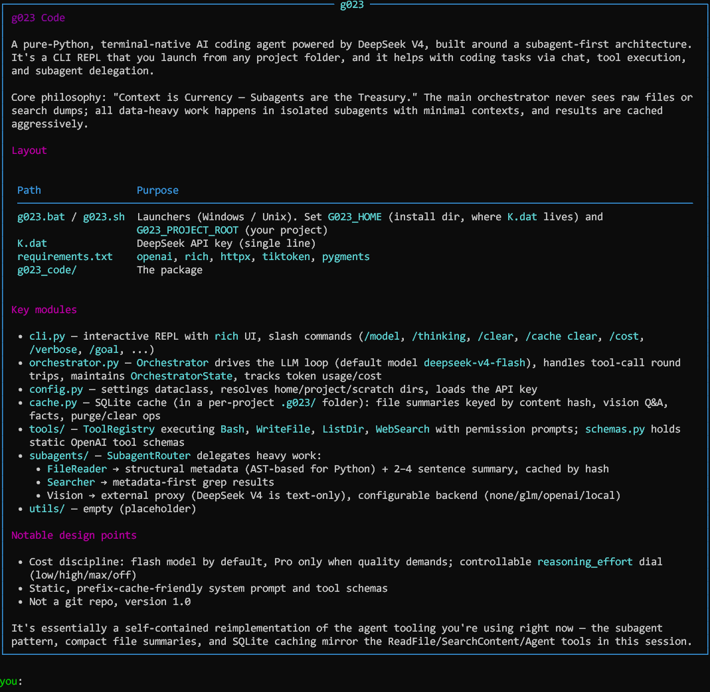

# g023 Code

**Pure-Python AI coding agent powered by DeepSeek V4**  
Subagent-First architecture · Context is Currency · Terminal-native

Version 1.0 — August 2026

---

<div align=center></div>

---

## Quick Start

1. **Put your DeepSeek API key** into `K.dat` (single line, no quotes):

   ```
   sk-...
   ```

2. **Install dependencies** (once):

   ```bash
   pip install -r requirements.txt
   ```

3. **Launch from any project folder**:

   **Linux / macOS / WSL**
   ```bash
   /path/to/g023-code/g023.sh
   ```

   **Windows**
   ```bat
   C:\path\to\g023-code\g023.bat
   ```

   Or add the folder to your PATH / create an alias called `g023`.

The launchers automatically set:
- `G023_HOME` → the installation folder (where `K.dat` lives)
- `G023_PROJECT_ROOT` → the directory you launched from (your project)

A per-project scratch folder `.g023/` is created for the SQLite cache.

---

## Architecture Highlights

- **Orchestrator (deepseek-v4-flash by default)** keeps only high-level reasoning, tool schemas, and compact summaries.
- **Subagents** handle all data-heavy work:
  - `FileReader` → structural metadata + 2-4 sentence summary (cached by content hash)
  - `Searcher` → metadata-first grep results
  - `Explore` / `Plan` → isolated reasoning with thinking mode
  - Vision → external proxy (DeepSeek V4 is text-only)
- **Aggressive SQLite cache** → repeated file reads cost $0.00
- **Prefix-cache friendly** system prompt + tool definitions stay static
- **Thinking mode** with controllable `reasoning_effort` (low / high / max)

---

## Slash Commands

| Command | Action |
|---------|--------|
| `/help` | Show help |
| `/model flash\|pro` | Switch orchestrator model |
| `/thinking low\|high\|max\|off` | Set reasoning effort |
| `/clear` | Reset conversation |
| `/cache clear` | Purge local SQLite caches |
| `/cost` | Token usage & rough cost |
| `/verbose` | Toggle reasoning excerpts |
| `/vision backend <name>` | Configure vision (none/glm/openai/local) |
| `/goal <text>` | High-level goal with max effort |
| `/exit` | Quit |

---

## Design Principles

1. Context is Currency — never pollute the orchestrator with raw files or search dumps.
2. Subagents are the Treasury — all heavy I/O happens in isolated, minimal contexts.
3. Cache everything that can be cached (file hashes, vision Q&A).
4. Prefer Flash for cost; use Pro only when quality clearly demands it.
5. Thinking mode is a controllable dial, not always-on max.

---

## Extending

- Vision: implement the backend in `subagents/router.py` → `_run_vision`
- New tools: add schema in `tools/schemas.py` + executor or subagent route
- Permissions: change defaults in `tools/registry.py`

---

## License

MIT — built for the g023 workflow.
